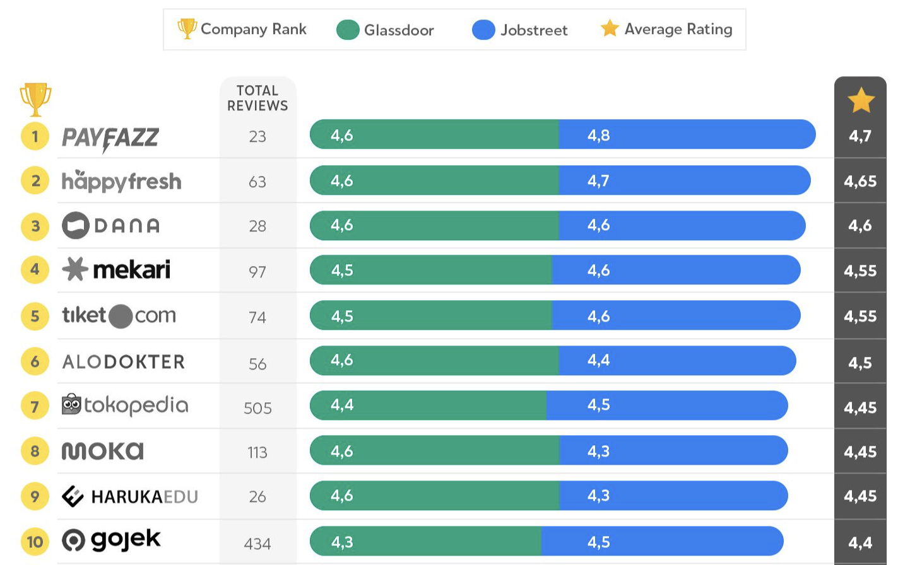
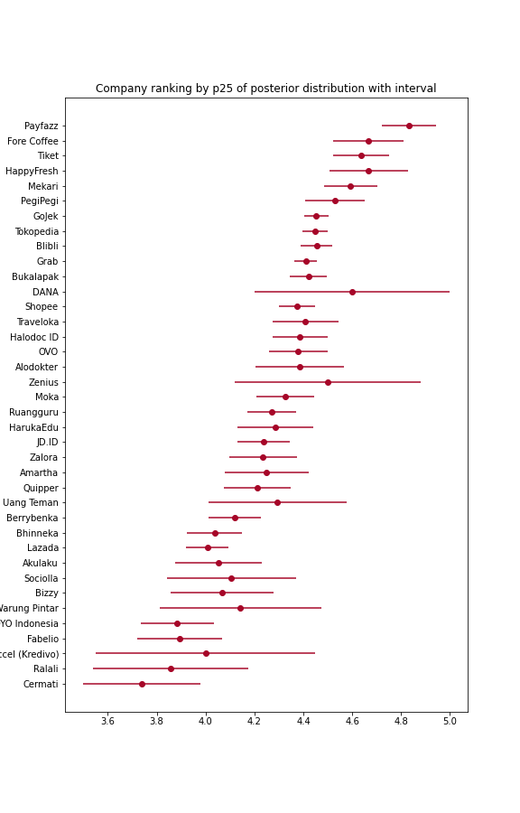

# Bayesian Company Ranking

## Company Ranking

**Background**

Recently I came across one article: [Revou Happiness Index](https://journal.revou.co/happiness-index-perusahaan-teknologi/). The report assesses 38 technology companies in Indonesia and ranks them using company reviews in Jobstreet and Glassdoor. Below is a cropped image of their result. Do you notice that there are companies with a lower number of reviews but have higher rank while having a pretty small difference in their average review? Example: Payfazz (23 reviews, avg 4.7) and Happyfresh (62 reviews, avg 4.65) with 0.05 difference in average review.



Having more data means that we have more evidence about something right? In this context, how could we decide what company should be in 1st rank? Isn't that 0.05 difference pretty small? On the other hand, we should give more weight to trust reviews for Happyfresh compare to Payfazz? (Since they have more reviews). Here we face a difficult situation where how far should we trust the data that we have? Then the next possible question is how could we incorporate uncertainty in the rank?

I create the repository to share how could we approach the problem using Bayesian perspective. By Bayesian means that we will take into account how far we should adjust our belief (of something) given data/evidence that we have, hence uncertainty will be considered in the rank calculation.

Scope of the analysis is a bit different compare to Revou's report. We will only take reviews of the 38 companies from Jobstreet. Because Glassdoor only shares the average review of a company, not in review level of granularity.

**Problem Statement**

```
Given company reviews from JobStreet, how should we better rank the companies?
```

**Alternative Methods**

1. Rank by Weighted Average Review
2. Rank by Statistics from Posterior distribution (Bayesian Analysis)

**1. Weighted Average Review**

It's inspired by how IMDb previously rank their Top 250 movies. Following is the formula.

```
weighted rank (WR) = (v ÷ (v+m)) × R + (m ÷ (v+m)) × C
 where:
  R = average review for the company = (mean_review)
  v = number of review for the company = (sum_review)
  m = minimum num of review required to be listed in the analysis
  C = the average review across the whole report
```

Notice that if a movie has only few number of review then the WR will be closer to the overall mean review (C). Contrary, if a movie has far higher number of review than `m`, the WR will close to the mean review given to the movie. It emphasizes the notion of believing the average review if only it has high number of review.

**2. Bayesian Analysis**

In Bayesian Analysis, we have prior believe about some parameters and we will update the believe given data about the parameters. In this analysis we have one parameter: `company review` with value between 1 and 5. We will assume the parameter have Gaussian (re: Normal) prior distribution. We will have Normal posterior distribution because Normal-Normal conjugate prior.

The advantage of using Bayesian Analysis is that we have posterior distribution instead of point estimation. From the posterior distribution we could derive any statistics about the parameter. For sorting/ranking purposes we could use `percentile 25 of the distribution` instead of mean. The below image shows why mean of posterior distribution is not a good metric for ranking. Contrary, p25 will tells us how uncertain we are about the posterior distribution (*circle represents mean of the posterior distribution).



---

## Environment
This notebook run using python 3.8. I use [Anaconda](https://docs.anaconda.com/anaconda/install/) to set the environment.

Install the Anaconda first and then open terminal
```bash
conda create --name new_environment python=3.7 # create new environment
conda activate new_environment # activate the env
pip install -r requirements.txt # install packages in requirements.txt
```
