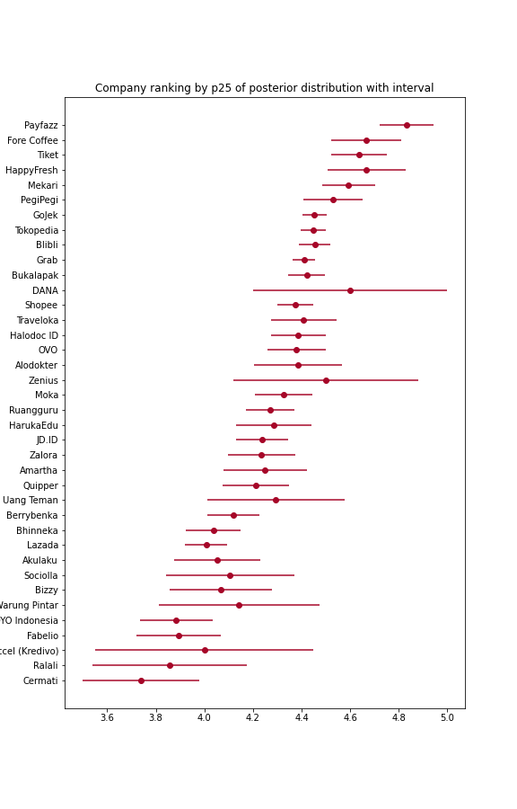

# company-rank-by-reviews

## Company Ranking

**Background**

TODO: put revou hapinnes index report and notice that something could be done better

**Problem Statement**

```
Given company reviews from JobStreet, how should we better rank the companies?
```

**Alternative Methods**

1. Rank by Weighted Average Review
2. Rank by Statistics from Posterior distribution (Bayesian Analysis)

**1. Weighted Average Review**

It's inspired by how IMDb previously rank their Top 250 movies. Following is the formula.

```
weighted rank (WR) = (v ÷ (v+m)) × R + (m ÷ (v+m)) × C
 where:
  R = average review for the company = (mean_review)
  v = number of review for the company = (sum_review)
  m = minimum num of review required to be listed in the analysis
  C = the average review across the whole report
```

Notice that if a movie has only few number of review then the WR will be closer to the overall mean review (C). Contrary, if a movie has far higher number of review than `m`, the WR will close to the mean review given to the movie. It emphasizes the notion of believing the average review if only it has high number of review.

**2. Bayesian Analysis**

In Bayesian Analysis, we have prior believe about some parameters and we will update the believe given data about the parameters. In this analysis we have one parameter: `company review` with value between 1 and 5. We will assume the parameter have Gaussian (re: Normal) prior distribution. We will have Normal posterior distribution because Normal-Normal conjugate prior.

The advantage of using Bayesian Analysis is that we have posterior distribution instead of point estimation. From the posterior distribution we could derive any statistics about the parameter. For sorting/ranking purposes we could use `percentile 25 of the distribution` instead of mean. The below image shows why mean of posterior distribution is not a good metric for ranking. Contrary, p25 will tells us how uncertain we are about the posterior distribution (*circle represents mean of the posterior distribution).



---

## Environment
This notebook run using python 3.8. I use [Anaconda](https://docs.anaconda.com/anaconda/install/) to set the environment.

Install the Anaconda first and then open terminal
```bash
conda create --name new_environment python=3.7 # create new environment
conda activate new_environment # activate the env
pip install -r requirements.txt # install packages in requirements.txt
```
